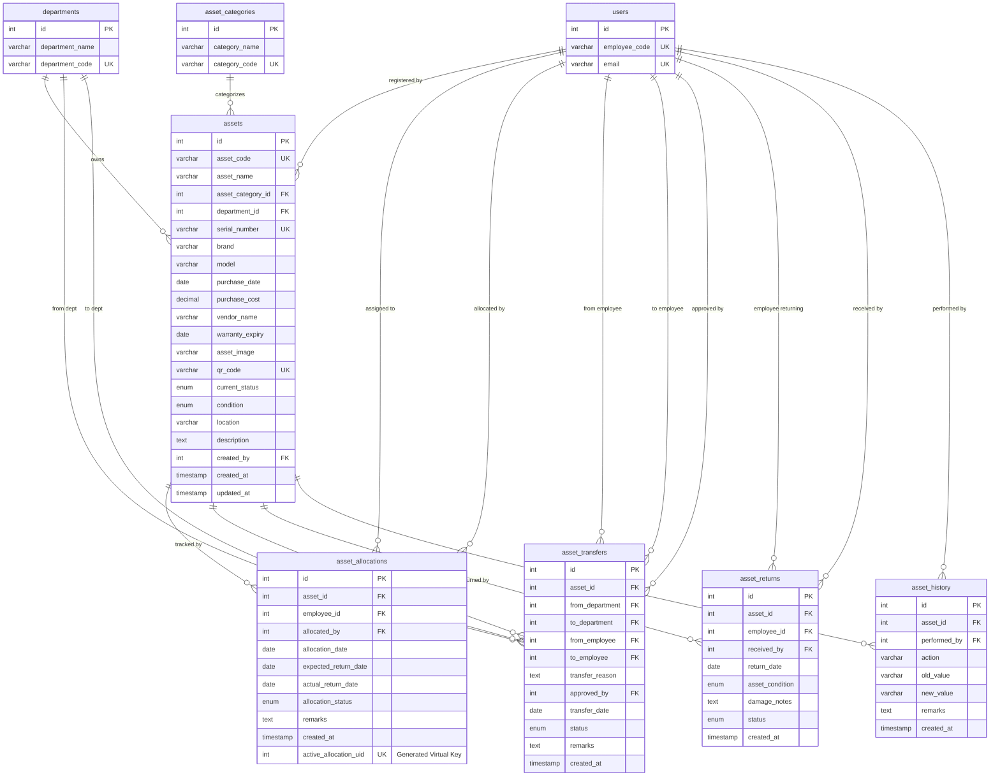

# AssetFlow - Asset Management Database Module Design Document

This document details the database architecture designed specifically for the **Asset Management Module** of the **AssetFlow** Enterprise Asset & Resource Management System. It builds directly upon the existing Core/Admin module database without modifying or replicating its tables.

---

## 1. ER Diagram

The diagram below maps all entity tables in the Asset Management module, highlighting relationships and foreign key connections to the pre-existing Core/Admin tables (`users`, `departments`, `asset_categories`).



---

## 2. Normalization Analysis (Up to 3NF)

The schema complies fully with **Third Normal Form (3NF)** rules to ensure there are no insert, update, or delete anomalies.

### First Normal Form (1NF)
* All columns contain atomic, indivisible values.
* Composite parameters like purchase details (costs, date, model, brand, serial) are separated into individual, distinct columns.
* Enum columns (`current_status`, `condition`, `allocation_status`, `status`) represent isolated states, preventing multi-valued entries.

### Second Normal Form (2NF)
* Meets 1NF, and all non-key attributes are fully dependent on the primary keys.
* Composite tables such as `asset_allocations` and `asset_transfers` use a surrogate primary key `id`.
* The columns `from_department` and `to_department` in `asset_transfers` depend on the specific transfer record rather than the asset ID directly, eliminating partial dependencies.

### Third Normal Form (3NF)
* Meets 2NF, and there are no transitive dependencies.
* **Decoupling Vendor details**: Vendor details are stored as a simple label `vendor_name` in `assets`. In a more complex system, vendors could be split into a separate table. However, since no vendor-specific metadata is required by the prompt, keeping it as a label does not violate 3NF.
* **Separation of Allocation and Return Logs**: Allocation states and Return states are split into `asset_allocations` and `asset_returns`. This avoids mixing different transaction lifecycles under a single flat structure, which would otherwise introduce nullable fields and transitive updates.

---

## 3. Custom Database Constraints

### 1. Active Allocation Isolation
* **Requirement**: "One asset cannot be allocated to multiple employees at the same time."
* **Solution**: A standard composite unique constraint on `(asset_id, allocation_status)` would prevent an asset from having more than one `'Returned'` or `'Cancelled'` allocation, which violates real-world history logs.
* **Implementation**: We implemented a virtual generated column inside `asset_allocations`:
  ```sql
  `active_allocation_uid` INT GENERATED ALWAYS AS (IF(`allocation_status` = 'Active', `asset_id`, NULL)) VIRTUAL
  ```
  We then attached a `UNIQUE` constraint to this virtual key. Since MySQL/MariaDB permits multiple duplicate `NULL` values in a unique index, only the `'Active'` allocation will evaluate to the actual `asset_id`, effectively blocking any subsequent `'Active'` mappings for that asset.

### 2. Referential Constraints and Actions
* **Restrictive Deletion (`ON DELETE RESTRICT`)**:
  - Prevents deleting an `asset_category` if it contains assets.
  - Prevents deleting a `department` if assets are registered under it or actively being transferred.
  - Prevents deleting a `user` if they currently hold an active allocation.
* **Cascading Purges (`ON DELETE CASCADE`)**:
  - If an `asset` is physically purged/deleted, its logs in `asset_allocations`, `asset_transfers`, `asset_returns`, and `asset_history` are automatically deleted to prevent orphaned records.
* **Set Null Logs (`ON DELETE SET NULL`)**:
  - If a user is deleted, any logs they created (e.g. `created_by`, `approved_by`, `received_by`) are updated to `NULL` to retain historical audit records.

---

## 4. Automatic Database Audit Logs (Triggers)

To guarantee that every update or insert is permanently logged (satisfying the rule: *"Every update must be recorded in asset_history"*), we implemented two SQL database-level triggers:

1. **`trg_assets_after_insert`**:
   - Fires automatically after a new asset is registered.
   - Pushes an audit entry into `asset_history` stating `'Asset Registered'`.
2. **`trg_assets_after_update`**:
   - Fires automatically after any edit on the `assets` table.
   - Automatically compares `OLD.current_status` to `NEW.current_status`, `OLD.condition` to `NEW.condition`, and `OLD.location` to `NEW.location`.
   - If any of these values change, it writes an audit log to `asset_history` detailing the old value, the new value, and the modification timestamp.
