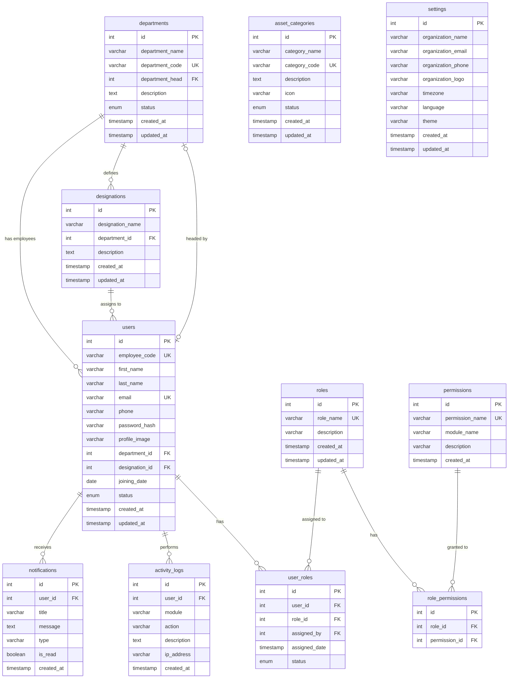

# AssetFlow - Admin Module Database Design Document

This document details the database architecture designed for the Admin module of the **AssetFlow** Enterprise Asset & Resource Management System. It covers normalization, structural relationships, referential constraints, indexing strategies, and future extensibility options.

---

## 1. ER Diagram

The diagram below maps all entity tables, fields, types, constraints, and relational cardinalities in the database schema.



---

## 2. Normalization Analysis (Up to 3NF)

To ensure high data integrity, minimize redundancy, and prevent modification anomalies, the schema is designed to meet **Third Normal Form (3NF)** standards.

### First Normal Form (1NF)
* **Requirement**: All columns must contain only atomic (indivisible) values, and there must be no repeating groups or multi-valued fields.
* **Implementation**:
  - Combined arrays (such as multiple roles or permissions mapped to one user) are extracted into separate bridge tables (`user_roles`, `role_permissions`).
  - Fields such as `first_name` and `last_name` are kept atomic rather than a single `name` string.
  - The `status` field uses database-native `ENUM` types to represent state.

### Second Normal Form (2NF)
* **Requirement**: Meet 1NF and ensure all non-key attributes are fully functionally dependent on the entire primary key (no partial dependency on composite keys).
* **Implementation**:
  - Composite bridge tables (`user_roles`, `role_permissions`) use an auto-incrementing surrogate primary key `id`, while enforcing unique composite constraints (`uq_user_role_assignment` and `uq_role_permission`) to represent associations.
  - Attributes such as `assigned_date` in `user_roles` depend strictly on the combination of `user_id` and `role_id` (or surrogate key `id`), ensuring full dependence.

### Third Normal Form (3NF)
* **Requirement**: Meet 2NF and ensure there are no transitive dependencies (non-key columns depending on other non-key columns).
* **Implementation**:
  - **Designation Normalization**: The prompt originally specified storing a `designation` string directly in `users`. Doing so violates 3NF because a designation has properties (such as its description and its relationship to a specific department) that depend on the designation name rather than directly on the user ID. 
  - To resolve this, we normalized it by defining a separate `designations` table (`id`, `designation_name`, `department_id`, `description`) and updating the `users` table to reference `designation_id`. If a designation details update, the change occurs in one place rather than in hundreds of user records.
  - **Department Head Isolation**: In `departments`, the department head is modeled as a foreign key `department_head` referencing `users(id)`, rather than storing user details (such as first name or email) in the department record.

---

## 3. Relationships & Referential Integrity

Referential integrity guarantees that associations between tables remain consistent during insert, update, and delete actions.

| Parent Table | Child Table | Relationship Type | Foreign Key Column | Delete Rule | Update Rule | Rationale |
| :--- | :--- | :--- | :--- | :--- | :--- | :--- |
| `users` | `departments` | 1-to-1 (Optional) | `departments.department_head` | `ON DELETE SET NULL` | `ON UPDATE CASCADE` | If a user who is a department head is deleted, the department remains active but the head is set to NULL. |
| `departments` | `users` | 1-to-Many | `users.department_id` | `ON DELETE RESTRICT` | `ON UPDATE CASCADE` | Restricts deleting a department if it still contains active employees, avoiding orphaned user records. |
| `departments` | `designations` | 1-to-Many | `designations.department_id` | `ON DELETE CASCADE` | `ON UPDATE CASCADE` | If a department is deleted, all its designations are deleted. |
| `designations` | `users` | 1-to-Many | `users.designation_id` | `ON DELETE RESTRICT` | `ON UPDATE CASCADE` | Restricts deleting a designation if employees are currently holding it. |
| `users` | `user_roles` | 1-to-Many (Bridge) | `user_roles.user_id` | `ON DELETE CASCADE` | `ON UPDATE CASCADE` | If a user is deleted, their associated role assignments are deleted. |
| `roles` | `user_roles` | 1-to-Many (Bridge) | `user_roles.role_id` | `ON DELETE RESTRICT` | `ON UPDATE CASCADE` | Restricts deleting a role if users are still assigned to it. |
| `users` | `user_roles` | 1-to-Many | `user_roles.assigned_by` | `ON DELETE SET NULL` | `ON UPDATE CASCADE` | Logs the assigner. If the assigner user is deleted, the record of the assignment remains but `assigned_by` is set to NULL. |
| `roles` | `role_permissions` | 1-to-Many (Bridge) | `role_permissions.role_id` | `ON DELETE CASCADE` | `ON UPDATE CASCADE` | If a role is deleted, all its permission mappings are deleted. |
| `permissions` | `role_permissions` | 1-to-Many (Bridge) | `role_permissions.permission_id` | `ON DELETE CASCADE` | `ON UPDATE CASCADE` | If a permission is deleted, all its role associations are deleted. |
| `users` | `activity_logs` | 1-to-Many | `activity_logs.user_id` | `ON DELETE SET NULL` | `ON UPDATE CASCADE` | Retains audit trails even if a user account is deleted for compliance/security purposes. |
| `users` | `notifications` | 1-to-Many | `notifications.user_id` | `ON DELETE CASCADE` | `ON UPDATE CASCADE` | Deletes a user's notifications if the user account is deleted. |

---

## 4. Key Constraints and Indexing Strategy

To guarantee rapid query response times under high database load, indexes are placed on columns frequently used in `WHERE`, `JOIN`, `ORDER BY`, and `GROUP BY` operations.

### Constraints Enforced
1. **Primary Keys**: Every table contains a auto-incrementing integer `id` PRIMARY KEY, which guarantees unique identification of each record and physical ordering of rows (clustering index) for InnoDB.
2. **Unique Constraints**:
   - `users.employee_code` & `users.email`
   - `departments.department_code`
   - `roles.role_name`
   - `asset_categories.category_code`
   - `permissions.permission_name`
   - `user_roles(user_id, role_id)` & `role_permissions(role_id, permission_id)` (prevents duplicates)

### Explicit Performance Indexes
* **Foreign Key Optimization**: Foreign keys in InnoDB automatically create indexes, which optimizes joins between `users`, `departments`, `designations`, and bridge tables.
* **`idx_notifications_user_id_is_read`**: Composite index optimizing queries for fetching unread messages/notifications for a specific user (a highly frequent dashboard query).
* **`idx_activity_logs_user_id`**, **`idx_activity_logs_created_at`**, & **`idx_activity_logs_module`**: Speeds up audit trail searches by module type, user, or date range.
* **`idx_users_status` & `idx_departments_status`**: Speeds up queries fetching active/inactive lists for drop-downs and menus.

---

## 5. Enterprise Extensibility (Future Module Integration)

The schema is built to be a robust foundation, allowing future modules to integrate cleanly without structural refactoring.

```
       +-------------------------------------------------------------+
       |                        ADMIN MODULE                         |
       |  [users]  [departments]  [roles]  [permissions]  [settings] |
       +-------------------------------------------------------------+
                                      |
                                      v
       +-------------------------------------------------------------+
       |                       FUTURE MODULES                        |
       |                                                             |
       |  [Assets]                                                   |
       |    |-- references category_id -> [asset_categories.id]      |
       |    |-- references custodian_id -> [users.id]                |
       |                                                             |
       |  [Bookings & Assignments]                                   |
       |    |-- references user_id -> [users.id]                     |
       |    |-- references asset_id -> [assets.id]                   |
       |                                                             |
       |  [Maintenance & Audit]                                      |
       |    |-- references asset_id -> [assets.id]                   |
       |    |-- references performed_by -> [users.id]                |
       |                                                             |
       |  [QR Management]                                            |
       |    |-- references asset_id -> [assets.id]                   |
       +-------------------------------------------------------------+
```

### Module Integration Roadmap

#### 1. Assets Module
* Create an `assets` table. It will contain:
  - `id` (PK), `asset_name`, `serial_number`, `purchase_date`, `cost`, `status`
  - `category_id` FK -> references `asset_categories.id` (ON DELETE RESTRICT)
  - `department_id` FK -> references `departments.id` (ON DELETE RESTRICT)
  - `assigned_to` FK -> references `users.id` (ON DELETE SET NULL)

#### 2. Bookings & Resource Assignment
* Create a `bookings` table. It will contain:
  - `id` (PK)
  - `asset_id` FK -> references `assets.id` (ON DELETE CASCADE)
  - `user_id` FK -> references `users.id` (ON DELETE RESTRICT)
  - `request_date`, `start_date`, `end_date`
  - `status` ENUM ('Pending', 'Approved', 'Rejected', 'Returned')
  - `approved_by` FK -> references `users.id` (ON DELETE SET NULL)

#### 3. Maintenance Module
* Create a `maintenance_records` table. It will contain:
  - `id` (PK)
  - `asset_id` FK -> references `assets.id` (ON DELETE CASCADE)
  - `maintenance_type` (ENUM/VARCHAR)
  - `description`, `cost`
  - `start_date`, `completion_date`
  - `assigned_technician_id` FK -> references `users.id` (ON DELETE SET NULL)

#### 4. Audit & QR Management
* Create a `qr_codes` table referencing `assets(id)`.
* Create `audits` and `audit_details` tables to track inventory checks.
  - `audits` will reference `users.id` (as auditor)
  - `audit_details` will reference `assets.id` and specific states.
