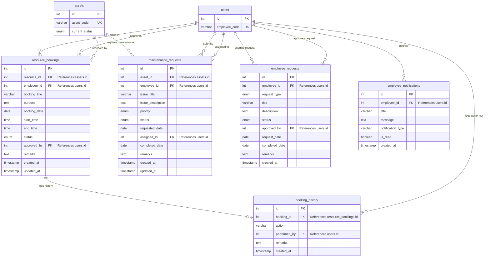

# AssetFlow - Employee Module Database Design Document

This document details the database architecture designed specifically for the **Employee Module** of the **AssetFlow** Enterprise Asset & Resource Management System. It builds on top of the pre-existing Core/Admin tables (`users`, `departments`, etc.) and Asset tables (`assets`, `asset_allocations`), integrating cleanly via relational keys.

---

## 1. ER Diagram

The diagram below maps all entity tables in the Employee module, highlighting relationships and foreign key connections to the pre-existing Core/Admin and Asset tables.



---

## 2. Normalization Analysis (Up to 3NF)

The schema complies fully with **Third Normal Form (3NF)** rules:

### First Normal Form (1NF)
* All columns contain atomic, indivisible values.
* Status fields use database-native `ENUM` sets rather than parsing sub-strings or arrays.
* Times are stored in distinct `DATE` and `TIME` columns rather than unstructured string values.

### Second Normal Form (2NF)
* Meets 1NF, and all non-key attributes are fully dependent on the primary keys.
* Composite tables such as `booking_history` use a surrogate primary key `id`.
* The `remarks` and `action` columns in `booking_history` depend entirely on the specific history log ID, ensuring no partial dependencies on parent keys.

### Third Normal Form (3NF)
* Meets 2NF, and there are no transitive dependencies.
* **Separation of Booking History and Bookings**: The status adjustment logs are pushed to a separate `booking_history` table rather than keeping audit trace text directly inside the `resource_bookings` table. This prevents transitive dependecies where history description would depend on a booking status state rather than the booking ID directly.
* **Triage Decoupling**: For maintenance logs, technician logs and remarks depend on the `maintenance_requests(id)` primary key, maintaining 3NF compliance.

---

## 3. Database Triggers for Business Validation

To guarantee strict compliance with the business rules, we implemented the following MySQL DDL triggers at the database level:

### 1. Booking Time Overlap Check (`trg_bookings_before_insert` / `trg_bookings_before_update`)
* **Business Rule**: *"Booking time should not overlap for the same resource."*
* **Trigger Logic**: Before inserting a new record or updating existing timeslots, the trigger queries the database to count existing entries for that `resource_id` on the same `booking_date` that overlap. Overlap is defined as:
  ```sql
  start_time < NEW.end_time AND end_time > NEW.start_time
  ```
  Only bookings with active states (`'Pending'`, `'Approved'`, `'Completed'`) are counted. If an overlap is found, it raises a signal exception `SIGNAL SQLSTATE '45000'` with a custom message.

### 2. Unavailable Resource Check
* **Business Rule**: *"Employee cannot book unavailable resources."*
* **Trigger Logic**: The trigger checks the status of the asset/resource inside the `assets` table. If the status is `'Under Maintenance'`, `'Disposed'`, or `'Lost'`, the trigger throws a signal error and rejects the insertion.

---

## 4. Referential Constraints & Performance Indexing

* **Cascading Rules**:
  - `ON DELETE RESTRICT`: Applied to `assets.id` and `users.id` referenced in active bookings, maintenance requests, and employee requests. This prevents accidental deletion of resources or employee records when they have historical data.
  - `ON DELETE CASCADE`: Applied to `booking_history` and `employee_notifications`. If a booking is deleted, its history is purged. If a user is deleted, their dashboard notifications are cleared.
  - `ON DELETE SET NULL`: Applied to log fields like `approved_by` or `assigned_to` to retain data audit details even if the administrative user is deleted.
* **Performance Indexing**:
  - **`idx_bookings_resource_date`**: Composite index on `(resource_id, booking_date)`. This optimizes query times for checking time overlaps during insertion/update.
  - **`idx_enotifications_emp_read`**: Composite index on `(employee_id, is_read)` to optimize the dashboard query fetching unread notifications.
